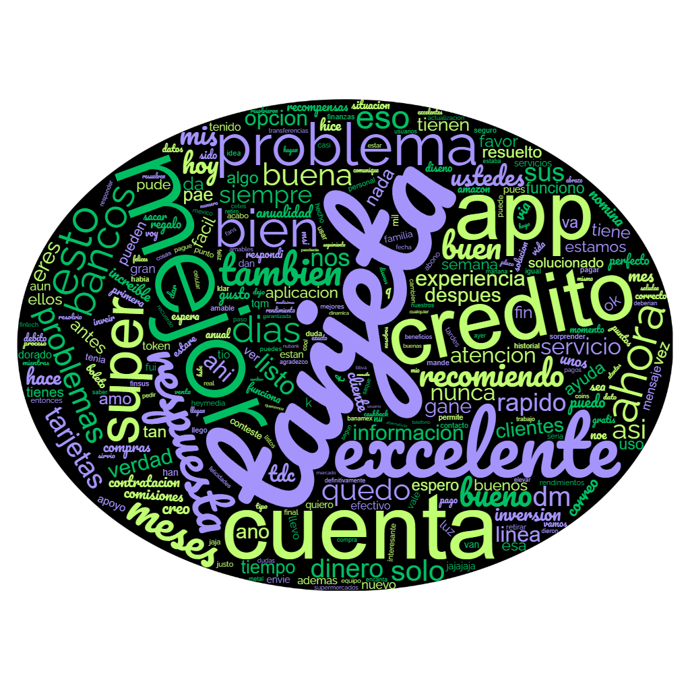
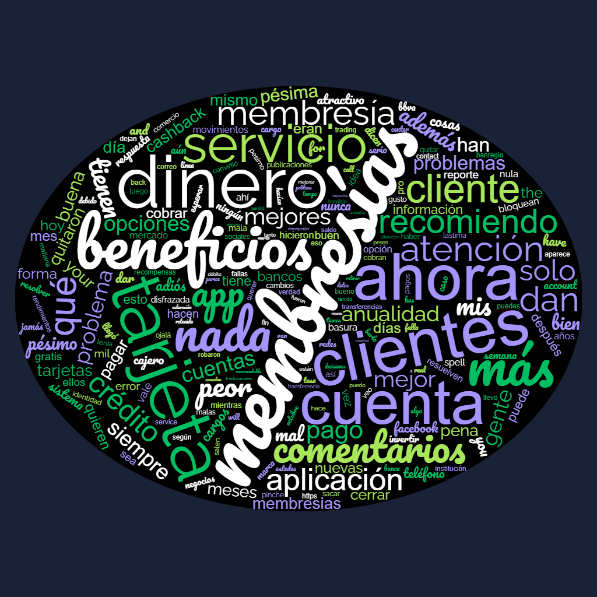
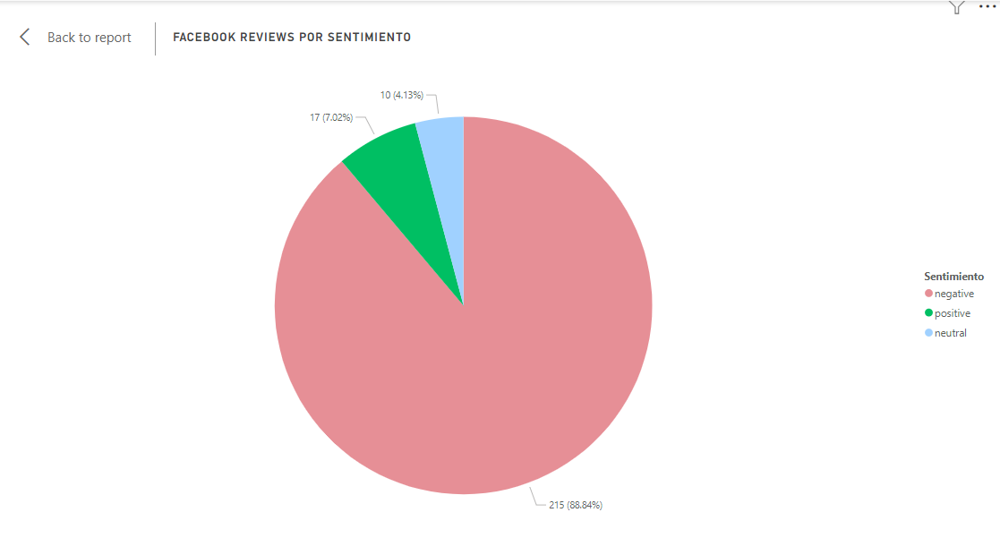

# HeyBanco Challenge 2024 - Team DataWizards

Welcome to the GitHub repository for the DataWizards team's submission for the 2024 Datathon. This repository contains all the resources, analyses, and documentation for our project, which focuses on comprehensive data analysis of comments from various platforms.

## Overview

### Challenge Definition

Our project revolves around analyzing a significant dataset of comments sourced from various platforms. The goal is to derive insightful analyses and propose actionable strategies. The scope of the analysis is broad, allowing for flexibility in addressing various areas if the problem is well defined and the solution is effectively articulated, analyzing the data, and scaling the proposals.

## Project Documentation

### Ideation Phase

Our brainstorming session can be accessed through this Canva document:
- [Brainstorming Ideas](https://www.canva.com/design/DAGESbJzl4E/CY9ZLfvFDUQV_iJKFDOoKQ/edit?utm_content=DAGESbJzl4E&utm_campaign=designshare&utm_medium=link2&utm_source=sharebutton)

### Final Presentation

Our final presentation outlining our findings and proposals is available here:
- [Final Presentation](https://www.canva.com/design/DAGESY6ceHs/cvg3EZSEOP5V00WMWE0UpA/edit?utm_content=DAGESY6ceHs&utm_campaign=designshare&utm_medium=link2&utm_source=sharebutton)

## Analysis Insights

### Sentimental Analysis

Located in the `classification_analysis` directory, this analysis seeks to uncover customer sentiments, identifying areas of strength and opportunities for improvement through sentiment categorization and temporal analysis. Visual insights are provided in the form of word clouds and sentiment timelines.

#### Visualization

    <table>
        <tr>
            <th>X Comments</th>
            <th>Facebook Reviews</th>
        </tr>
        <tr>
            <td></td>
            <td></td>
        </tr>
        <tr>
            <td></td>
            <td></td>
        </tr>
    </table>

### Topic Analysis

    

### Temporal Analysis

Analysis of the temporal patterns of comments and reviews, further details and visualizations can be found in the `temporal_analysis` directory.

## Conclusions

Detailed conclusions from our analyses are included in the final presentation document. These conclusions provide strategic insights into customer behavior patterns and recommend actionable steps for business improvement.
